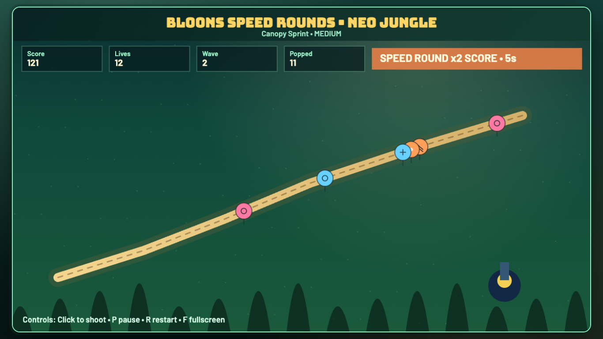
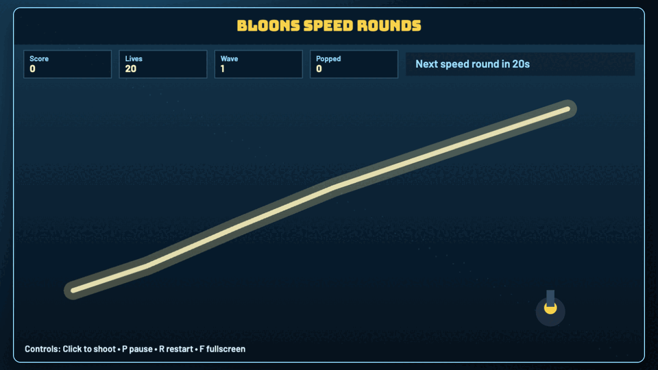
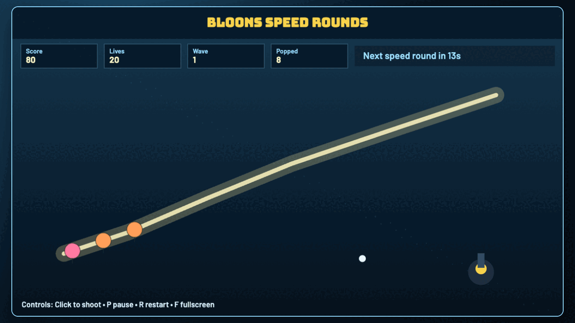
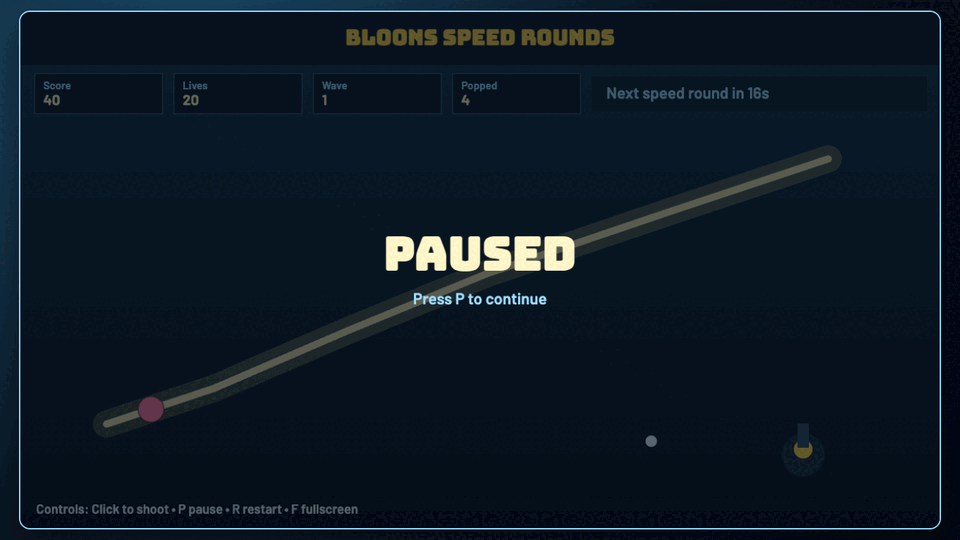

# daily-classic-game-2026-02-20-bloons-speed-rounds

<p align="center">
  <strong>Classic Bloons-style defense with deterministic speed-round spikes every 20 seconds.</strong>
</p>

<p align="center">
  
</p>

## GIF Captures
### Start and First Pops
<p align="center">
  
</p>

### Speed Round Burst
<p align="center">
  
</p>

### Pause and Reset
<p align="center">
  
</p>

## Quick Start
```bash
pnpm install
pnpm dev
pnpm test
pnpm build
```

## How To Play
- Click anywhere on the arena to fire darts from the monkey tower.
- Balloons follow the lane from left to right.
- Stop balloons before they escape the lane end.
- Controls:
- `P`: pause/resume.
- `R`: restart to seeded baseline.
- `F`: toggle fullscreen.

## Rules
- Game starts on the title screen and begins when you click `Start Game`.
- Each escaped balloon removes one life.
- You lose when lives reach zero.
- Clearing all balloons in a wave starts the next wave with more balloons.
- Deterministic scripted path is available at `?scripted_demo=1`.

## Scoring
- Base score: `10` points per balloon popped.
- Pops are deterministic for a fixed seed and action sequence.
- HUD tracks `Score`, `Lives`, `Wave`, and `Popped` count.

## Twist
- `Speed rounds` activate every `20s` of game time.
- During speed rounds (8s window):
- Balloon movement speed is multiplied by `1.75x`.
- Pop scoring is multiplied by `2x`.
- The top HUD turns orange and displays remaining speed-round time.

## Verification
```bash
pnpm test
pnpm build
WEB_GAME_URL="http://127.0.0.1:4173/?scripted_demo=1" node scripts/capture_playwright.mjs
```

Deterministic capture proof:
- `playwright/main-actions/state-2.json` shows score growth and pops.
- `playwright/main-actions/state-6.json` shows active speed round with countdown.

Browser hooks:
- `window.advanceTime(ms)`
- `window.render_game_to_text()`

## Project Layout
```text
src/
  constants.ts
  types.ts
  rng.ts
  collision.ts
  game.ts
  input.ts
  render.ts
  main.ts
scripts/
  self_check.mjs
  capture_playwright.mjs
playwright/
  main-actions/
assets/
  gifs/
docs/plans/
```
